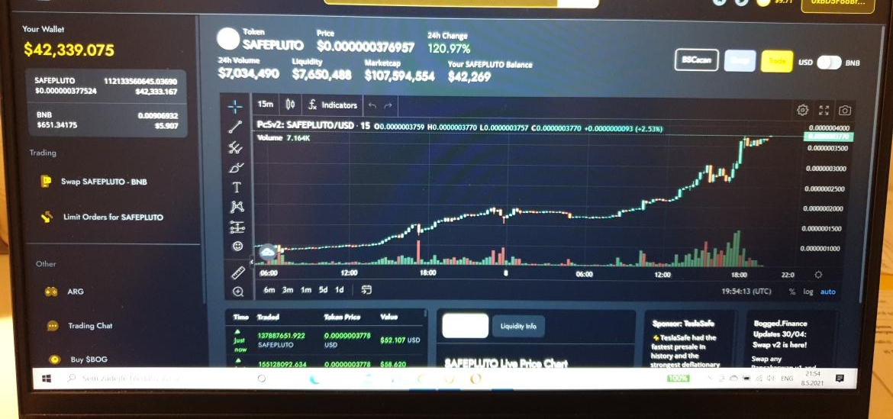

Hey everyone,

I built a basic sniping bot for pancakeswap. Simply put, you fill the settings in swapbot.js and it buys the token for the amount you choose when it hits the swap and liquidity is added.

# What are the features?:

[x] Buy early token gems with custom gas fee, slippage, amount. (DYOR)

[x] Auto approve fees

[x] Open source, with free node services (Literally don't have to pay anything to run this bot)

Working on:

[ ] Sell bought token with custom gas fee, slippage, amount.

[ ] Sell tokens with your custom increase in price, like 50%, 100%, 200%.

[ ] Demo how the code looks

# HOW TO RUN

Download the zip folder to get all the files -> extract it to a folder
Download nodejs for your PC
Set the variables in "Variables" at the top of swapbot.js
Free node included!
Input enough funds for fees and purchases into your wallet
Run with "node swapbot.js" command in the same terminal
Stop bot with Ctrl + C.

Successfull 40,000k snipe the other day :)

# TIPS AND TRICKS

For Pancakeswap have at least 0.5 BNB in funds, as you will need to get some fees, currencies and for the sniping itself
For Uniswap at least 0.5 ETH to get everything working smooth as some tokens you will want to snipe have big slippage and if the transaction fails you still pay the gas so don't waste money
Check new tokens on dextools
DYOR on dextools and see if the token contract you are sniping doesn't have rug pulls included
WARNING This bot is free and I did it as a hobby project. Great starting place for new devs. DYOR.

TROUBLESHOOT If your transaction failed:

1)Your gas price is too small 2)Your slippage is too small (use 30+ for early token)

